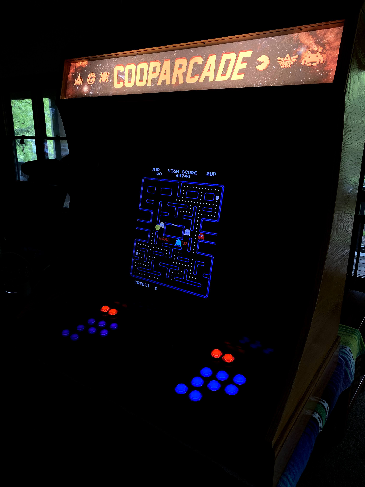

# The Cooparcade

I had always dreamed of making an arcade, and when the World shutdown in 2020 I had the chance to get in the woodshop with my dad and build The Cooparcade. This was one of my favorite projects I've ever worked on, from a sketh in my notebook to learning each step of the way to combine woodworking, software configuration, and electrical work. 

## The Making of the Cooparcade
import { YouTube } from '@astro-community/astro-embed-youtube';

    <YouTube id="EQiMXPu0F8k" />

## How It Was Made
* Custom maple cabinet
* Hardware from Micro Center - Raspberry Pi 4 B+, buttons, joysticks, controller board, speakers and an amplifier, spare tv monitor
* Software - [RetroPie OS](https://retropie.org.uk/) on top of Raspian OS; configured to the controller board
* Beers, good tunes, some command line, and every tool in the woodshop

We started in the way all great projects start, drinking a beer and diving into it with unjustified confidence and blind trust in "the process". The first step was to trace a tv monitor onto a piece of cardboard, which gave us our foundational dimensions for the cabinet. We built a frame around it and sketched out the general shape it would all take. 

I took inspiration from classic Nintendo controllers for the button and joystick layout. The goal was to be able to emulate retro games, Atari, NES, and SNES, and be able to run the whole arcade off of a Raspberry Pi. My dad and I pulled out some maple boards, made a few trips to Micro Center to get the hardware and wiring, and got to crafting. 

What I loved most about the process was spending time with my dad, leanrning tricks of the trade with woodworking, jig making, and the general acceptace of making mistakes and pivoting as we went. I had to call in the Mechanical Engineer, my little brother Tyler, to help me learn how to daisy chain the buttons. 

<YouTube id="UqWPe4T0P3k" />
 

Piece by piece we built the cabinet, with a jig that took the whole driveway to make a consistent arm arc for the curved sides. 

Glossed the board with some lacquer...

Assembly...

Play testing...
    <YouTube id="w-Gg1Im9kvg" />
 
Added speakers..

Coming together...

Designed the graphic for the lighted marquee... 

...and finished! 

Sadly I landed a new gig and had to return to my apartment in Denver...but before I did that we cranked out a second Cooparcade that I finshed and assembled in Colorado. Behold, The Cooparcade 2

