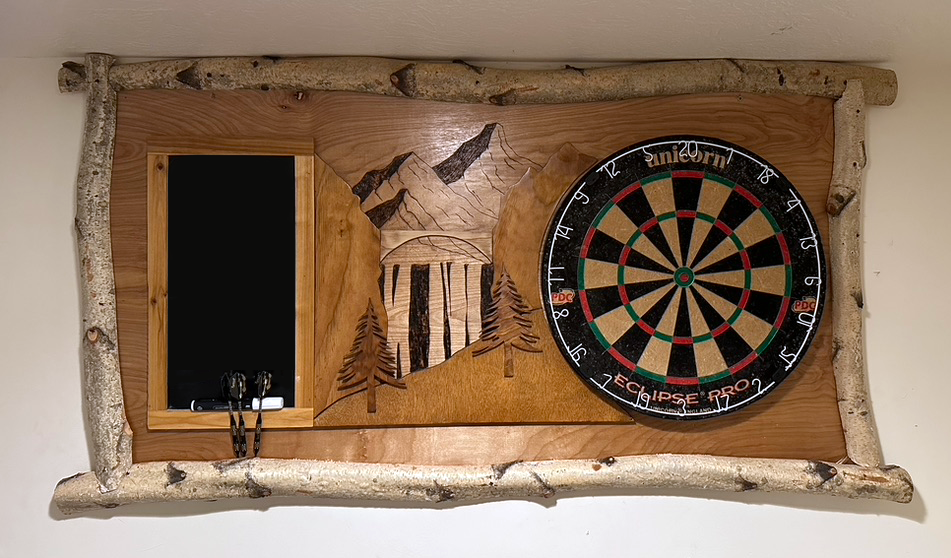
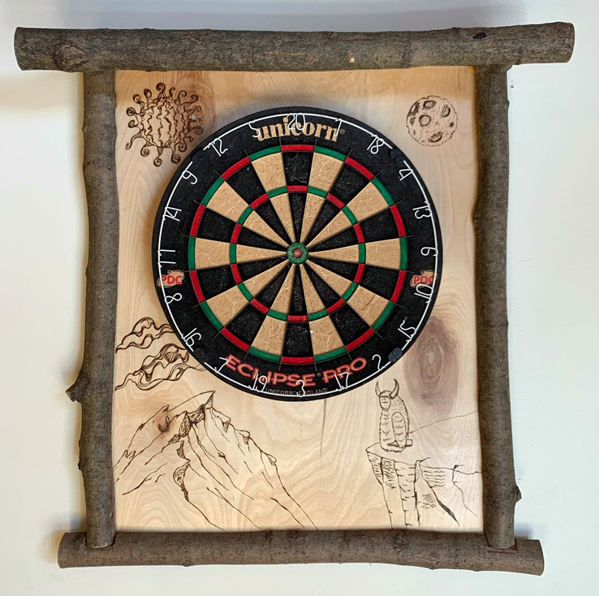

# The Mountain Bridge - Custom Dartboard

When I saw a downed birch tree in my dad's backyard I found the inspiration to create the Moutain Bridge dartboard. 
I used a scroll saw to cut out the layers, and wood burned the mountain and waterfall design. 

# The Yeti Mon - Custom Dartboard

I designed a Yeti as part of an egg nog label, and decided to place him back in his natural habitat on this custom dartboard.  

