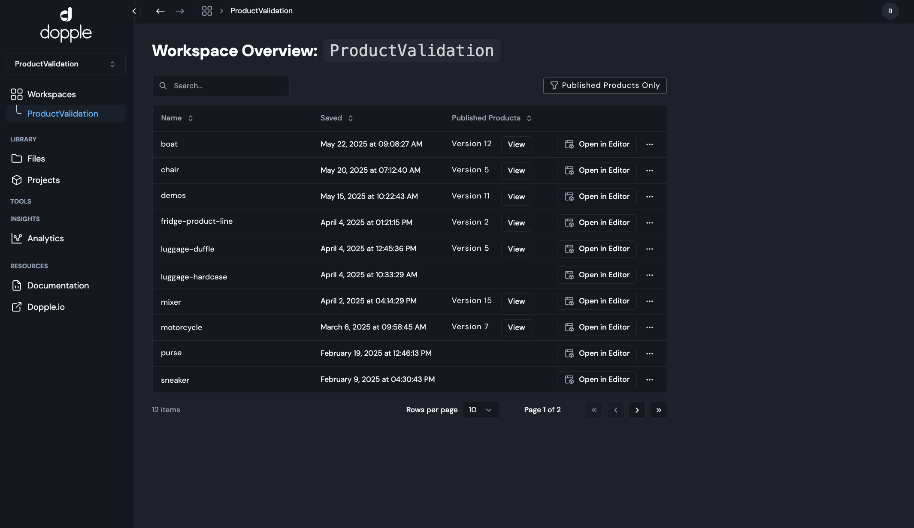
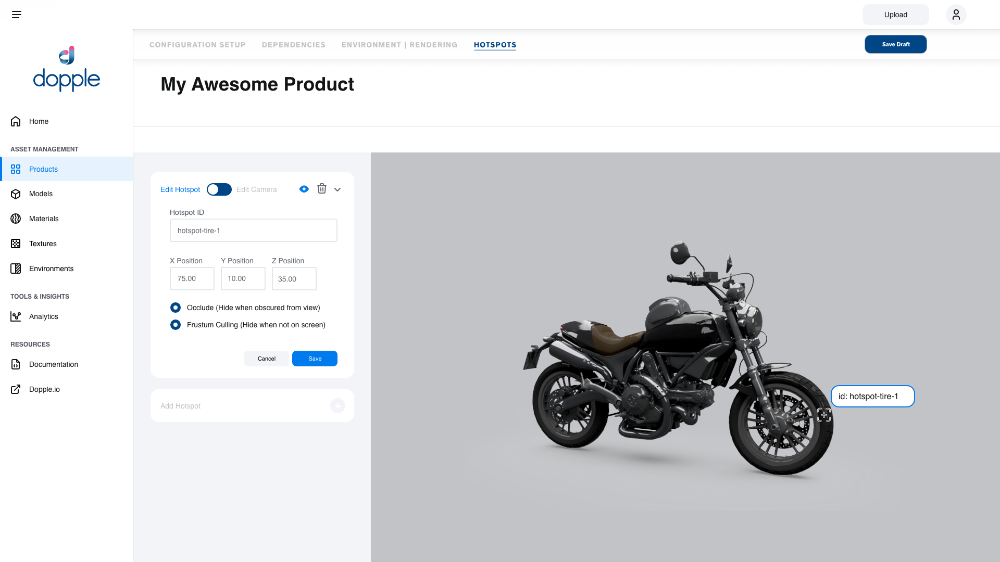

# The Dopple 3D Platform

At Dopple I was a founding Product Manager, and built two major iterations of the Dopple 3D Platform with a small, pre-series A startup team. In addition to my Sr Product Manager role, I served as the Co-Product Designer, collaborating with the Creative Director and UX Designer to design the full platform. The Dopple Platform allowed Clients and their creative teams to manage 3D ecommerce experiences, with a CMS for storing of their digital twins, a 3D Web Editor for setting up their 3D projects, and an Experience Designer for creating immersive 3D experiences for the web. Once Published, a 3D Product could be embedded on any commerce site, from Shopify to a custom Wordpress site.

Built to scale and serve both enterprise brands through SMBs, Users can organize their projects in various workspaces. Agencies especially took to organzing client's assets into segmented workspaces to keep IP and data clean.

As the Dopple Platform evolved, the fomerly complex and expert workflows became accessible and intuitive, enabling any creative marketer or web developer to build out immersive 3D experiences.  

Expert Users such as 3D Artists were able to setup complex projects in the 3D Editor, tuning the fidelity and aesthetics to create photo-realistic 3D for the web.  
