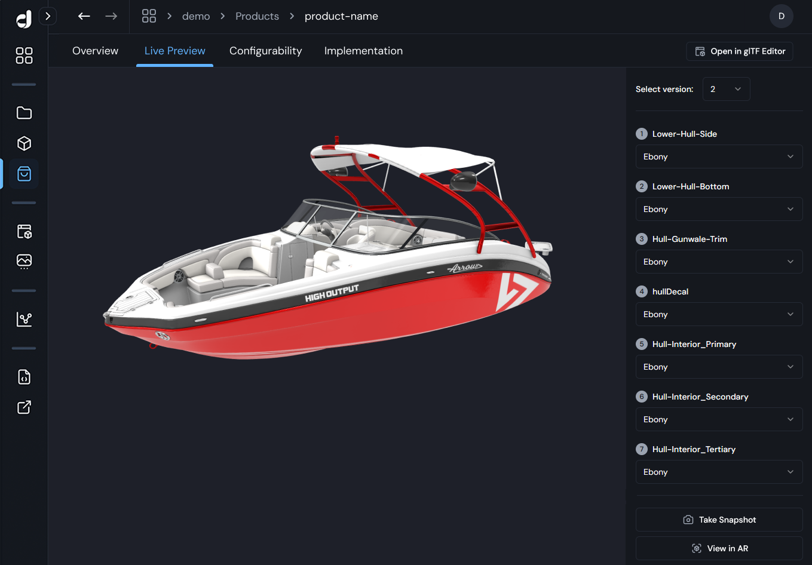
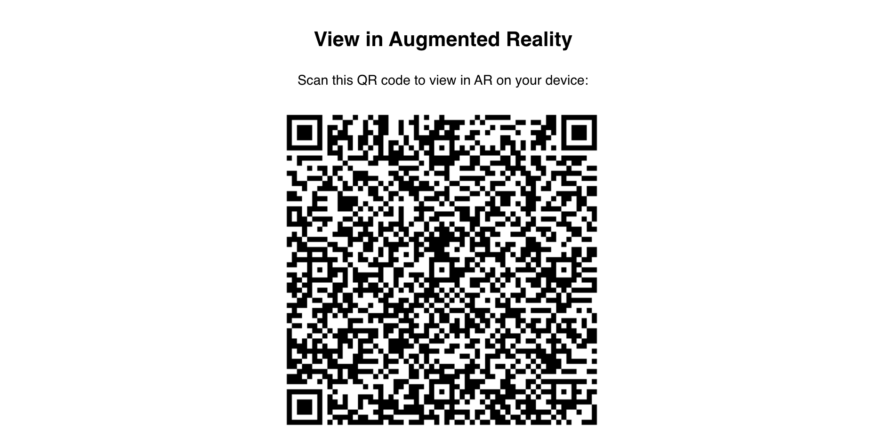
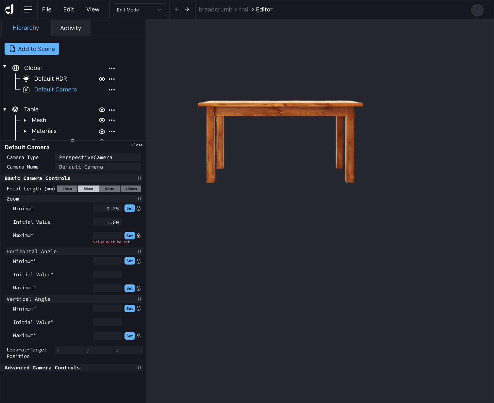
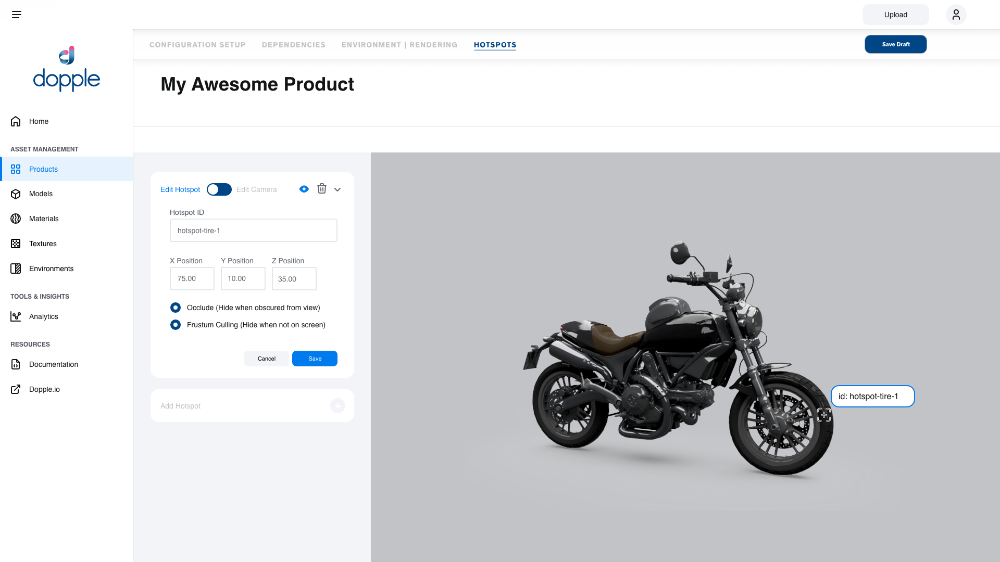
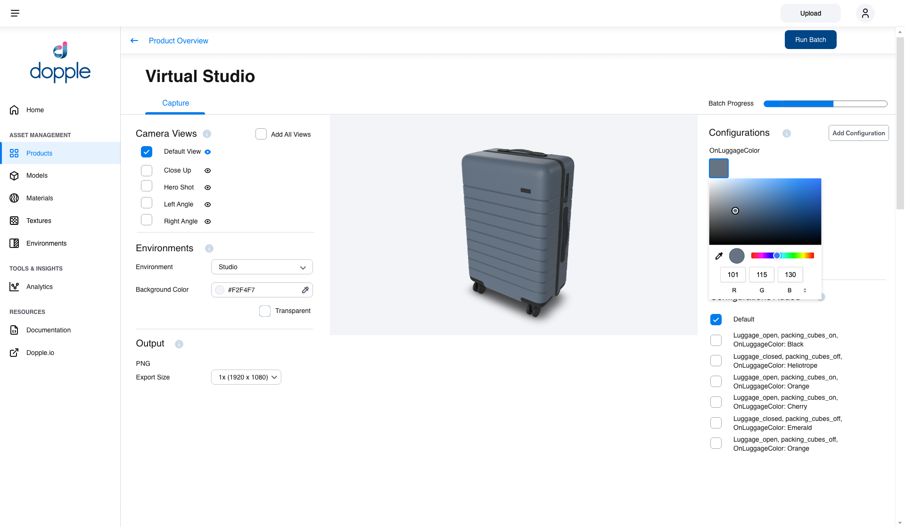
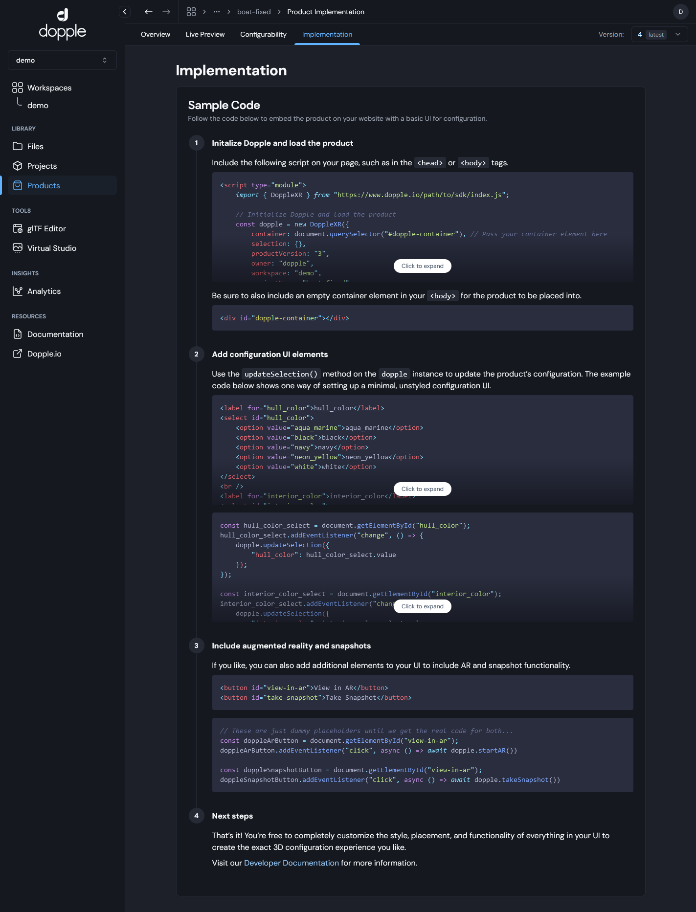
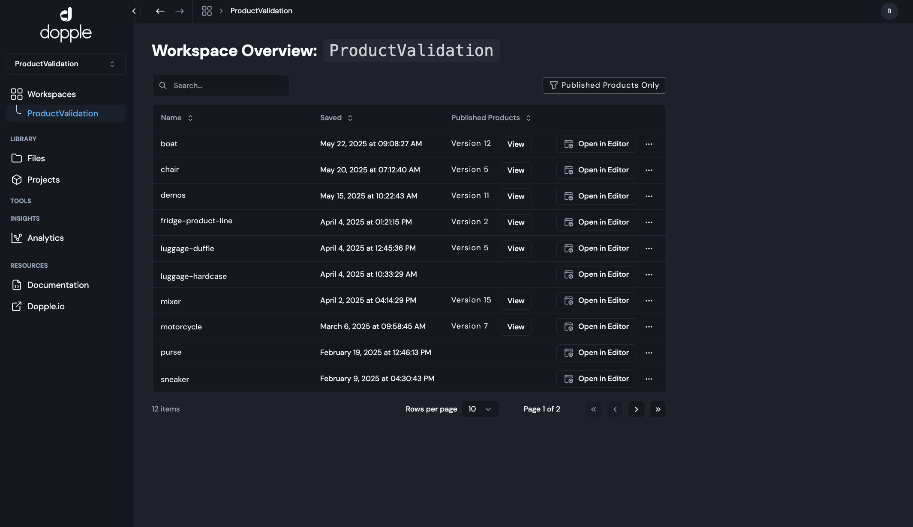
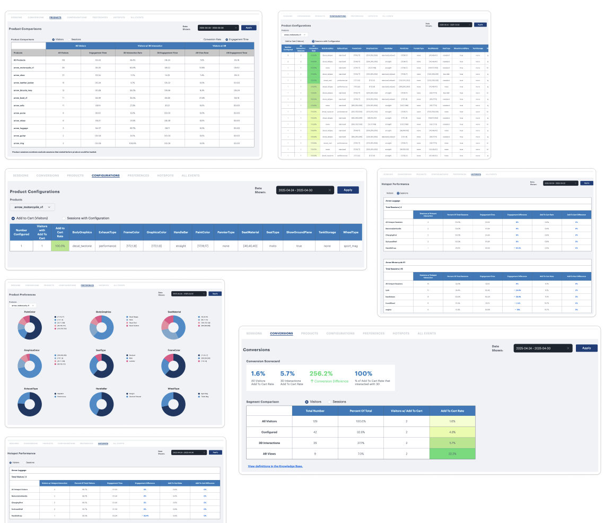

import { YouTube } from '@astro-community/astro-embed-youtube';

    <YouTube id="Gd2jlpTRc2k" />

# The Dopple 3D Platform
At Dopple I was a founding Product Manager where I built and designed the Dopple 3D Platform with a small, seed-funded startup team. 
In addition to my Senior Product Manager role, I served as the Co-Product Designer.

## Platform Highlights
* CMS/Content Library for managing 3D Product digital twins
* Experience Designer workflow for setting up interactive elements, such as configurability, augmented reality, animations and cameras, and hotspots
* Virtual Studio for generating lifestyle imagery withg AI-generated scenes
* 3D Editor for Artists to manage all aspects of the 3D scene
* Live Preview with configuration and AR UI menus pre-generated
* Integration embed code generation for pre-set implementation
* Analytics Dashboards and Reports 
* Support for GLB and glTF and Khronos Material Extensions 
* Version Control and Whitelisting for A/B testing and full control over content distribution

### Live Preview
Users are able to preview live performance and UX of their 3D Products without writing any code.

### Augmented Reality
Augmented Reality out-of-the-box for all 3D Products. Scan this QR code to see the Dopple Mixer in your space.

### 3D Editor with Scene Hierarchy
Artists and Creatives can manage all aspects of the 3D scene with a visual hierarch tree for easily editing models/materials/textures, lights, cameras, animations, and hotspots.

### Experience Designer
The Experience Designer offers a visual UX to setup the 3D experience.

### Virtual Studio
Marketers and brands can generate batches of virtual photography and place all the SKUs of their products in AI-generated scenes for product markeing and ecommerce imagery.

### Template Generation for 3D Implementations 
Once published, Users can take the generated embed code and easily implement to their commerce site.

Built to scale and serve both enterprise brands through SMBs, Users can organize their projects in various workspaces. Agencies especially took to organzing client's assets into segmented workspaces to keep IP and data clean.

### Analytics Dashboards
Brands can track engagement and performance of their 3D Products with built-in analytics dashboards and reports, and an API integration with GA4 to marry your data with your existing analytics stack.

